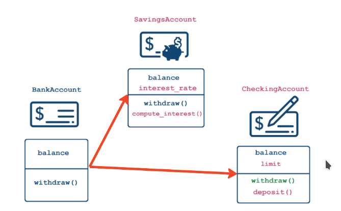

# Object Oriented Programming In Python

Objects:
Object = data + functionality

Example:
- Customer:
  - data:
    - email = xyz@gmail.com
    - phone = xxx-xxx-xxxx

  - functionality
    - place order
      - order Functionality
    - cancel order


In Python, Everything is an Object

## Classes as blueprints
- Class: blueprint for objects outlining possible states and behaviors
  - State = an object's data: this is the **attributes**
    Example: df.shape
  - Behavior = an object's functionality: this is the **methods**
    Example: df.head(10)

```py
# Display attributes and methods:
print(dir([1, 2, 3, 5]))
```

## Class Anatomy:
```py
class <name>:
    def <function_name>(self, variables...):
        pass
    def identity(self, name):
        self.name = name
        print(f"Customer name is {name}")

c_one = Customer()
c_two = Customer()
```

- WHAT IS self?
  - Classes are templates
  - self should be the first argument of any method
  - self is a stand-in for the (not yet created) object:
    ```py
    # continuing from above anatomy
    c_one.identity("alex") # outputs: Customer name is alex
    # the code is same as
    Customer.identity(c_one, "alex") # same output
    print(c_one.name) # outputs: alex
    ```

## __init__ **constructor** Class Anatomy:
```py
class <name>:
    """Docstrings"""
    def __init__(self, variables..., variableX = 0): # supports default value too
        self.name = variables[0]
        ...

    def <methodName>(self, ...):
        pass
```
Constructor
- Add Data to Object when creating it
- __init__() method is called everytime object is created.
  - Constructor is called automatically because of __methodname__ syntax.

```py
 <name>.__doc__ # outputs the docstring of the object
```

## Classes vs. instance attributes
Core Principles of OOP
- Encapsulation: Bundling of data and methods
- Inheritance: Extending existing class
- Polymorphism: Creating Unified Interface

Class-level attributes:
- Data shared among all instance of a class
- "Global variables" within the class
```py
class <name>:
    # Class Attribue
    <variable> = <variable value>
    Min = 300000
```
> Note: to access the class attribute, use -> ClassName.AttrName

### Class methods:
```py
class Employee:
    def __init__(self, name, salary):
        self.name = name
        self.salary = salary

    # use decorator to declare class method
    @classmethod
    # cls argument refers to the class
    def from_file(cls, filename):
        # DO stuff here
        # Can't use any instance attributes
        with open(filename, "r") as file:
            name = file.readline().strip() # Read the first line
            salary = file.readline().strip() # read second line
            return cls(name, int(salary)) # cls(...) will call __init__(...)


# Call the class, not the object
emp = MyClass.from_file("xyz.txt")
print(emp.name)
```
- Possible to define class methods
- Must have a narrow scope because they can't use object-level data

Method is a function that is specific to the class.

This decorator allows us to modify the behavior of the method defined directly afterwards.

- Allow alternate constructors
- can only have one __init__()
- use class methods to create **objects**

When to use:
- Alternate constructors
- Methods that don't require instance-level attributes
- Restricting to a single instance (object) of a class: **Singleton** -> init
  - Database connections
  - Configuration Settings


## Class Inheritance:
Code reuse


- Someone has already done it
- OOP is great for customizing functionality by combining with other packages

```py
class BankAccount:
    def __init__(self, balance):
        self.balance = balance

    def withdraw(self, amount):
        self.balance -= amount


class SavingsAccount(BankAccount):
    def __init__(self, balance, interest_rate):
        BankAccount.__init__(self, balance)
        self.interest_rate = interest_rate

    def deposit(self, amount):
        self.balance += amount

    def withdraw(self, amount, fee = 0):
        if (amount <= self.limit):
            BankAccount.withdraw(self, amount + fee)


# Inheritance "is-a" relationship
print(isinstance(SavingsAccount, BankAccount)) # TRUE but inverse is false
```
You can run the constructor of parent class first by Parent.__init__(self, args...)


## Operator Overloading: comparing objects
The **__eq__()** method
- __eq__() is called when 2 objects of class are compared using *==*
- Accepts 2 arguments: self and other-objects to compare
- Return Boolean

```bash
class Customer:
    def __init__(self, acc_id, name):
        self.acc_id, self.name = acc_id, name

    def __eq__(self, other):
        print("__eq__() is called")
        # return True if all attributes match
        return (self.acc_id == other.acc_id) and (self.name == other.name) and (type(self) == type(other))

customer1 = Customer(123, "Alex")
customer1 = Customer(123, "Alex")

customer1 == customer2
# prints:
    # __eq() is called
    # True
```

Other Comparison Operators:
```md
- == : __eq__()
- != : __ne__()
- >= : __ge__()
- <= : __le__()
- > : __gt__()
- < : __lt__()
```

> PYTHON will always call the comparison operators for the child class

## String representation and Inheritance comparison
__str__():
  - print(obj), str(obj)
  - informal, for end user
  - string representation
__repr__()
  - repr(obj), printing in console
  - formal, for developer
  - reproducible representation
  - fallback for print()
```py
print(np.array([1,2,3]))
# Output: [1 2 3]

str(np.array([1, 2, 3]))
# Output: '[1 2 3]'

repr(np.array([1, 2, 3]))
# Output: 'array([1, 2, 3]'
```


```py
class Customer:
    def __init__(self, name, balance):
        self.name = name
        self.balance = balance

    def __repr__(self):
        return f"Customer('{self.name}', {self.balance})"
```


## Exceptions:
- Prevent the program from terminating when exception is raised.
- try except finally(optional)
- raising errors: raise ValueError("...")

In python exceptions are classes that are inherited from BaseException Or Exception
```bash
BaseException
+-- Exception
    +-- ArithmeticError
    |   +-- FloatingPointError
    |   +-- OverflowError
    |   +-- ZeroDivisionError
    +-- TypeError
    +-- ValueError
    |   +-- UnicodeError
    |       +-- UnicodeDecodeError
    |       +-- UnicodeEncodeError
    |       +-- UnicodeTranslateError
    +-- RuntimeError
    ...
+-- SystemExit
...
```

Custome Exceptions:
```py
class BalanceError(Exception):
    pass

class Customer:
    def __init__(self, name, balance):
        if balance < 0:
            raise BalanceError("Balance has to be non-negative!")
        else:
            self.name = name
            self.balance = balance
```
